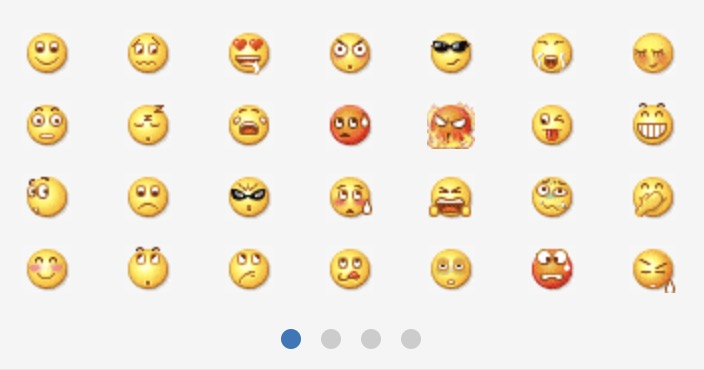

# swiper vue

swiper 滚屏是很常用到的一个滑屏插件，vue开发的项目只需要安装Vue-Awesome-Swiper依赖，基于[Swiper4](http://www.swiper.com.cn)的API就可以很快速的开发了，[Swiper4](http://www.swiper.com.cn)用法有所改动，请查看API进行开发，默认安装最新版本

[Vue-Awesome-Swiper githup地址：](https://github.com/surmon-china/vue-awesome-swiper)

#### NPM安装

```
$ npm install vue-awesome-swiper --save
```

#### 页面import所需模块，注册组件

```
import { swiper, swiperSlide } from 'vue-awesome-swiper'

export default {
  components: {
		swiper,
    swiperSlide,
  },
  ...
}
```
#### 使用SPA组件

```
<!-- 通过 ref 查找swiper实例 -->
<template>
  <!-- options 初始化swiperOption -->
  <swiper :options="swiperOption" ref="mySwiper" @someSwiperEvent="callback">
    <!-- slides -->
    <swiper-slide>I'm Slide 1</swiper-slide>
    <swiper-slide>I'm Slide 2</swiper-slide>
    <swiper-slide>I'm Slide 3</swiper-slide>
    <swiper-slide>I'm Slide 4</swiper-slide>
    <swiper-slide>I'm Slide 5</swiper-slide>
    <swiper-slide>I'm Slide 6</swiper-slide>
    <swiper-slide>I'm Slide 7</swiper-slide>
    <!-- Optional controls -->
    <div class="swiper-pagination"  slot="pagination"></div>
    <div class="swiper-button-prev" slot="button-prev"></div>
    <div class="swiper-button-next" slot="button-next"></div>
    <div class="swiper-scrollbar"   slot="scrollbar"></div>
  </swiper>
</template>

<script>
  export default {
    name: 'carrousel',
    data() {
      return {
        swiperOption: {
          // 所有的参数同 swiper 官方 api 参数
          // ...
        }
      }
    },
    computed: {
      swiper() {
        return this.$refs.mySwiper.swiper
      }
    },
    mounted() {
      // current swiper instance
      // 然后你就可以使用当前上下文内的swiper对象去做你想做的事了
      console.log('this is current swiper instance object', this.swiper)
      this.swiper.slideTo(3, 1000, false)
    }
  }
</script>
```

[smail.vue](./smail.vue)就是基于swiper+vue开发的表情列表，类似于微信表情；
- 通过props传的值expression展示隐藏
- 只有一个点击事件iconClick，将文案通过vue.$emit传给父级

